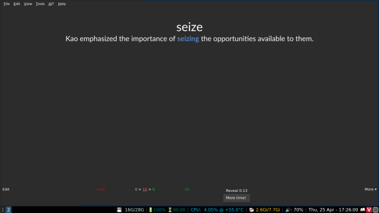
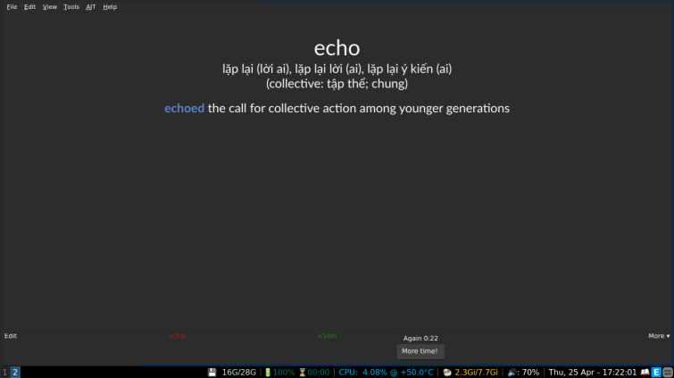
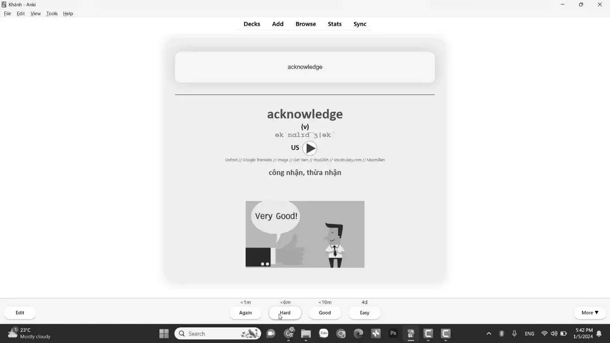

# Chọn bộ thẻ

## Tải bộ thẻ Template để tự làm thẻ nhanh, đẹp, gọn

Các bác bấm vào đây để tải nha: [tải tại đây](./assets/template.apkg).

**Preview (Mang tính chất minh họa thiệt)**

**Mặt trước**

**Mặt sau**

## 3000 từ vựng thông dụng

Đây là bộ thẻ gốc mà mình gợi ý ở bài đăng cũ. Tải [tại đây](https://ankivn.com/bo-the/ngoai-ngu/tieng-anh/3000-tu-vung-tieng-anh-thong-dung/)

(Cái này thực ra có màu nhưng mà tui lỡ chụp màn hình lúc để màn hình đen trắng, mà lười sửa lắm nên thôi =D)

_Preview_

**Mặt trước**

**Mặt sau**

