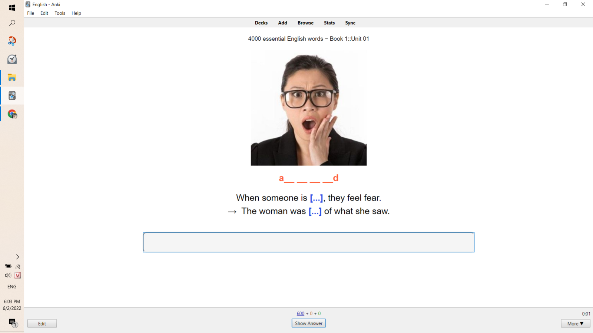
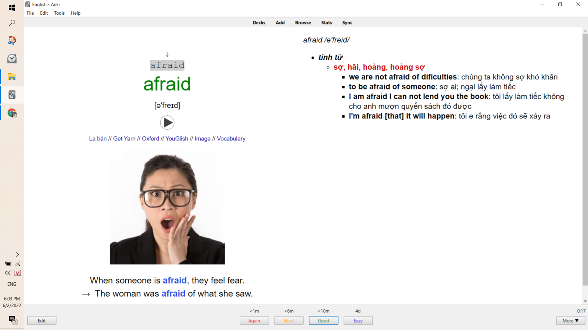
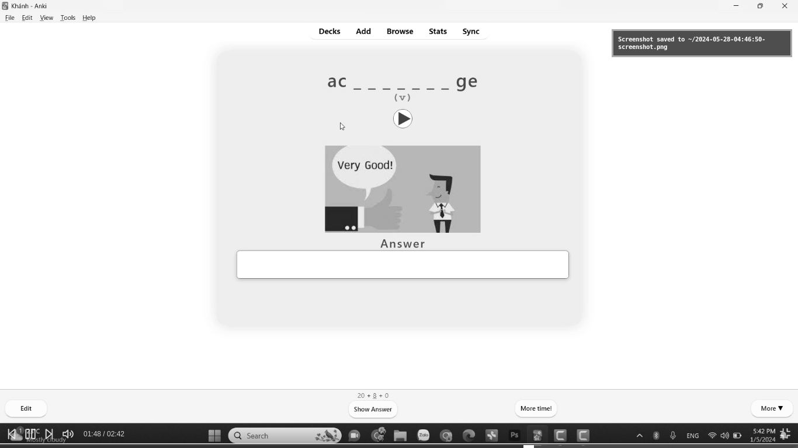
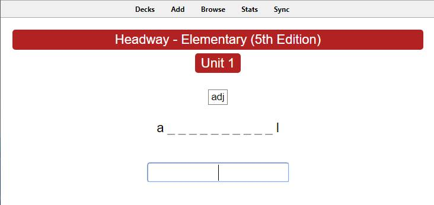
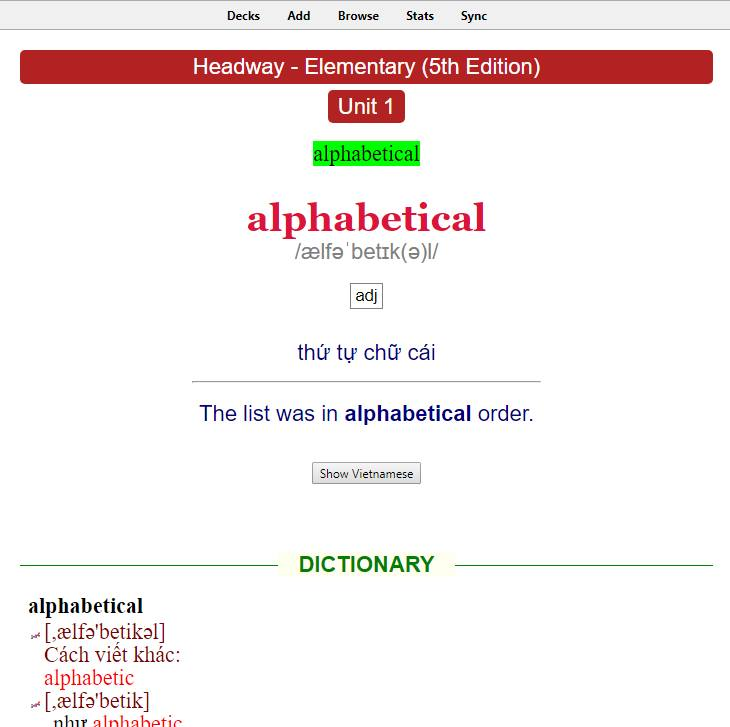
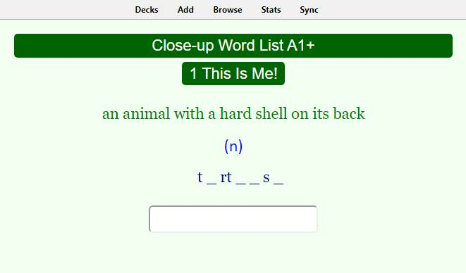
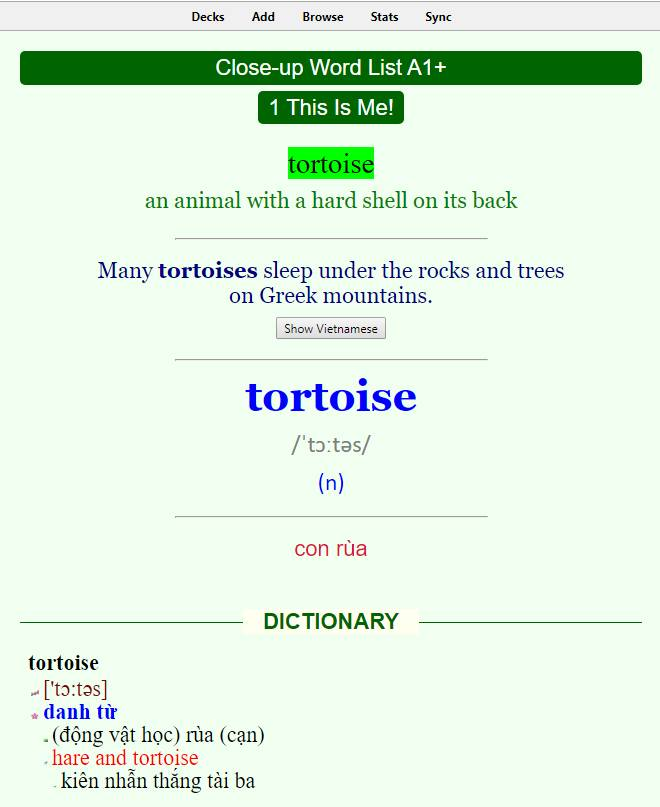

## Chọn bộ thẻ

Ở đây mình sẽ liệt kê một số bộ thẻ 3000 - 4000 từ vựng (Kèm hình ảnh bộ thẻ) để các bạn chọn.

Một ghi chú nhỏ, Anki chỉ đơn giản là công cụ để ghi nhớ, khi bạn học được khoảng 3000 từ cơ bản thì lúc đó vai trò của Anki sẽ trở lên hết sức mờ nhạt, chỉ cần hàng ngày vào chạy Due card (Tập dùng Anki rùi sẽ biết) mất khoảng 10 phút, rồi dành toàn bộ thời gian đi đắm mình vào Media Tiếng Anh là cách để lên trình nhanh và tự nhiên nhất.

### 4000 Essential English Words
 
Đây là bộ thẻ được chỉnh sửa bởi Lien Nguyen. Tải [tại đây](https://onedrive.live.com/?authkey=%21AM24%2D%2Ddh7NTTsUM&id=B2A16982FC148F5C%2111425&cid=B2A16982FC148F5C)

_Preview_

**Mặt trước**

**Mặt sau**

### 3000 từ vựng thông dụng

Đây là bộ thẻ gốc mà mình gợi ý ở bài đăng. Tải [tại đây](https://ankivn.com/bo-the/ngoai-ngu/tieng-anh/3000-tu-vung-tieng-anh-thong-dung/)

(Cái này thực ra có màu nhưng mà tui lỡ chụp màn hình lúc để màn hình đen trắng, mà lười sửa lắm nên thôi =D)

_Preview_

**Mặt trước**

**Mặt sau**

### Headway

Đây là bộ thẻ thuộc giáo trình Headway, [bấm vào đây để tải](https://ankivn.com/bo-the/ngoai-ngu/tieng-anh/headway-5th-edition-word-list-a1-c1/)

Có 6 bộ, bạn tải từ bộ 1 đến bộ 4 và lượng từ vựng học sẽ rơi vào khoảng 3500 từ.  

_Preview_

**Mặt trước**

**Mặt sau**

### Close-up (Không khuyến khích)

Một lý do cơ bản cho điều này là vì bộ thẻ này quá nặng, định dạng thẻ cũng gần giống với bộ thẻ Headway ở trên.

Nếu bạn vẫn muốn tìm hiểu thêm và tải, [bấm vào đây](https://ankivn.com/bo-the/ngoai-ngu/tieng-anh/close-up-word-list-a1-a2-b1-b1-b2-c1-c2/)

**Mặt trước**

**Mặt sau**

